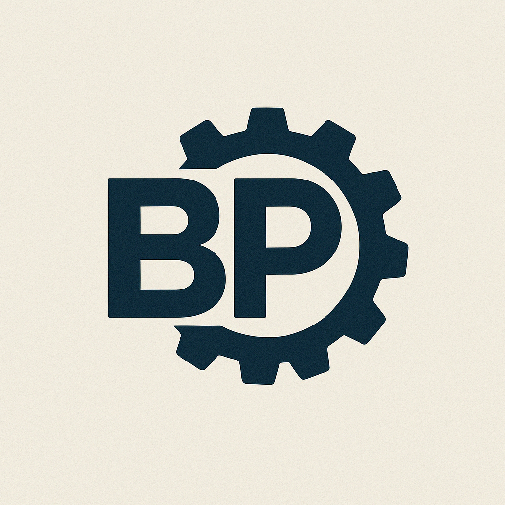

# 🧩 Botpress Integration Toolkit for VS Code

A Visual Studio Code extension to streamline the development of [Botpress](https://botpress.com) integrations — making your workflow faster, cleaner, and painless.



---

## ✨ Features

- 🔍 **Context Menu for `bpDependencies`**

  - Easily **add or remove dependencies** in the `bpDependencies` field of your `package.json`
  - Auto-detect available interfaces based on your local file system

- ⚙️ **Scaffold New Botpress Integrations**

  - Quickly bootstrap new bots, integrations or plugins from the VS Code context menu
  - Choose your destination folder and let the extension generate the structure

---

## 🚀 Getting Started

1. Install this extension from the [Visual Studio Marketplace](https://marketplace.visualstudio.com/)
2. Right-click in your project’s `package.json` or inside the folder you want to create a new addon
3. Use the `Botpress` context menu to add dependencies or scaffold a new integration

---

## 📦 Example

```json
"bpDependencies": {
  "files-readonly": "../../interfaces/files-readonly",
  "readable": "../../interfaces/readable"
}
```

Right-click → Botpress > Add Dependency
Right-click → Botpress > Remove Dependency

🔧 Requirements

- Node.js >= 16
- Botpress SDK (included via workspace dependencies)
- VS Code

💙 Contributing

Feel free to open issues or pull requests — your feedback helps make this tool better!
